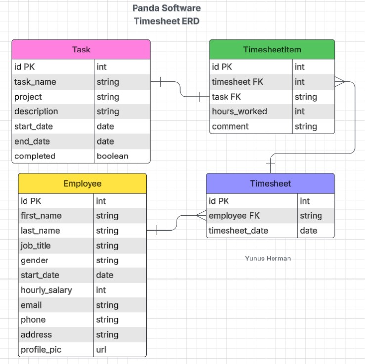
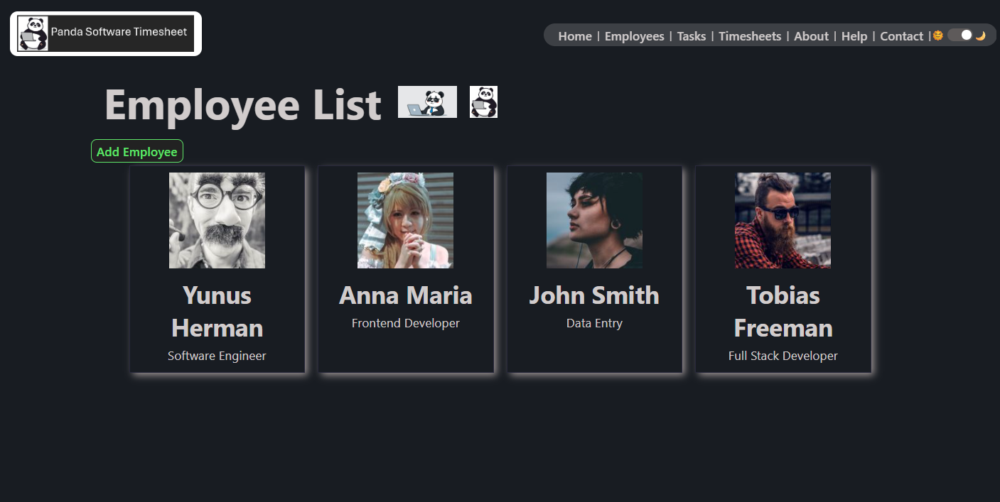
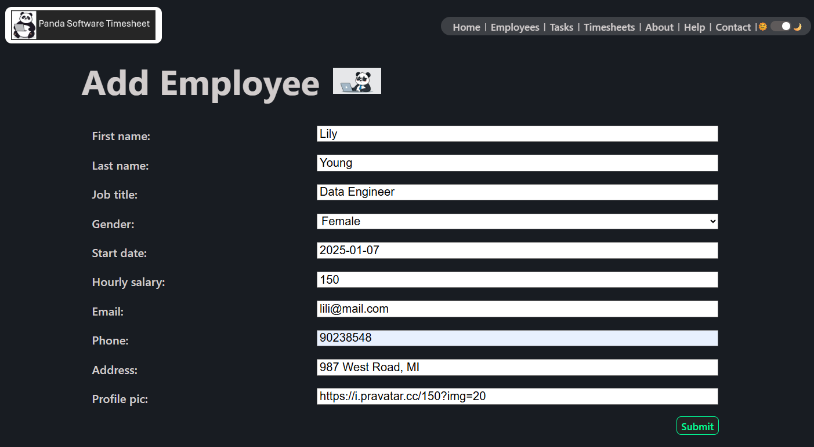
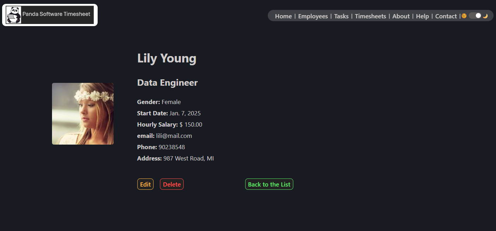
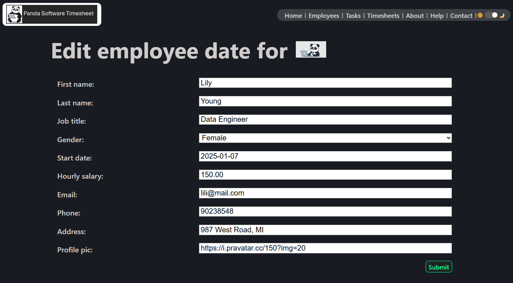
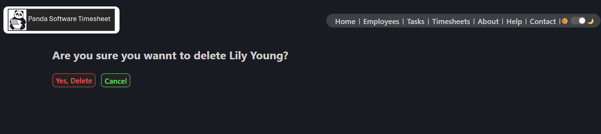
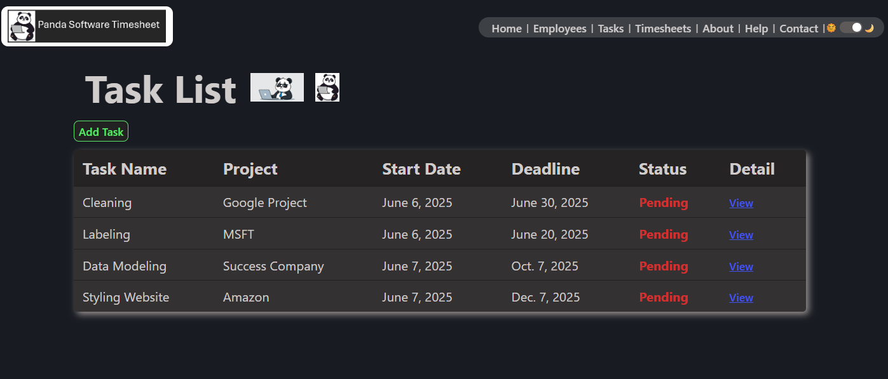
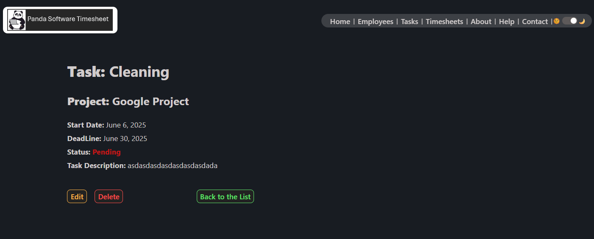
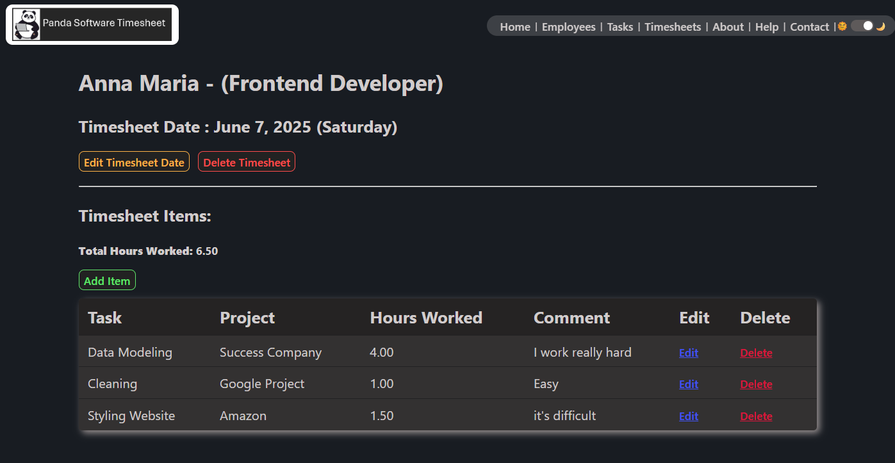

# Welcome to Panda Software Timesheet App! Panda software is a software company whose employees work remotely and freelance. To manage tasks and track ongoing projects, Panda Software uses a timesheet app, so that employees can report the number of hours they work every day and payroll can pay their salaries according to the number of hours worked.

## ERD: 

## Employee list screenshot:

## Employee creation screenshot:

## Employee detail screenshot:

## Employee update screenshot:

## Employee delete screenshot:

## Task list screenshot:

## Task Detail screenshot:

## Timesheet detail & the item list

## Links:
### Trello: 
https://trello.com/invite/b/683dc5fe11d66d18e6a0ce48/ATTIed33ef7c009f8e5479ff655c5f5632662A100877/panda-software-timesheet
### Lucidchart: 
https://lucid.app/lucidchart/02e4c1e9-3b4e-4d9a-9db6-e7f052e603dc/edit?viewport_loc=134%2C56%2C1330%2C618%2C0_0&invitationId=inv_f19290b6-8b23-43e9-814e-7e54747dc1ed
### GitHub: 
https://github.com/yunus-h/panda_software_timesheet.git
### deployed app / Heroku: 

## Attributions: 
- https://www.w3schools.com/
- https://www.deepl.com/
- https://www.google.com/
- https://lucid.app/
- https://trello.com/
- https://id.heroku.com/

## Next Steps:
- Create a login with access as an employee who can only see their own timesheet. or access as a manager/admin/HR who can see all employee timesheets.

- Add employee wage payment transactions with this app.

- Add search by employee name, date, etc. can also sort by certain fields in the employee list, timesheet list, timesheet items list, and task list.

- Add other tables such as project tables, etc. And also add other fields that can add information to those who need it.